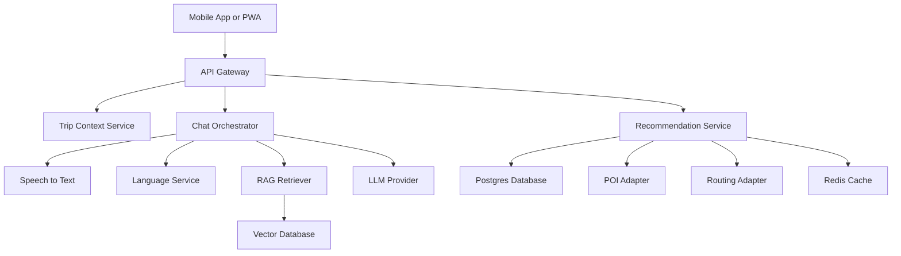
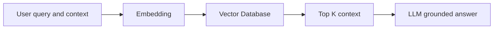
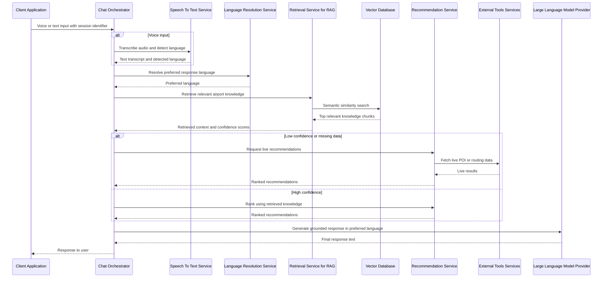

# LLD — AeroGuide AI

## Low Level Design for Multilingual, Voice-First AI Transit Assistant for Airports

> This LLD expands the HLD into implementable modules, APIs, data models, flows, and GitHub-safe Mermaid diagrams.

## 1) MVP Scope

### In-Scope (MVP)

* Passenger provides **Airport + Terminal + Gate** (manual input; indoor GPS optional later)
* **Voice + Text** chat interface
* **Multilingual** support (detect + respond in the same language)
* **RAG** retrieval from airport knowledge base (POIs, facilities, rules)
* **Time-aware recommendations** (only reachable options)
* Fallback to external APIs for open or routing ETA when available

### Out of Scope (MVP)

* Full indoor navigation with live blue-dot accuracy
* Real-time queue prediction without airport partnership
* Persistent storage of raw audio
* Live gate-change feeds

---

## 2) Architecture Modules

### 2.1 Client (Mobile App / PWA)

Responsibilities:

* Collect trip context: airport, terminal, gate, boarding time
* Voice record and upload or text input
* Render recommendations (list-first)
* Show ETA and simple directions
* Capture feedback (like, dislike, too far, closed)

---

### 2.2 API Gateway

Responsibilities:

* Session handling (anonymous token)
* Rate limiting
* Routing to internal services
* Request validation

---

### 2.3 Trip Context Service

Responsibilities:

* Validate airport, terminal, gate
* Resolve gate to zone mapping
* Calculate remaining time before boarding
* Normalize language preference

Inputs:

* airport_code, terminal, gate, boarding_time, locale

Outputs:

* zone_id, time_to_board_minutes, preferred_language

---

### 2.4 Chat Orchestrator

Responsibilities:

* Handle chat requests (voice or text)
* Call Speech-to-Text when input is voice
* Resolve preferred language
* Invoke RAG Retriever for grounding
* Invoke Recommendation Service
* Call LLM to compose final response
* Enforce anti-hallucination rules

---

### 2.5 RAG Retriever

Responsibilities:

* Generate embeddings for user queries
* Retrieve top-K semantic documents from Vector DB
* Apply metadata filters (airport, terminal, zone, category)
* Return context chunks with similarity scores

---

### 2.6 Recommendation Service

Responsibilities:

* Fetch candidate POIs from curated DB
* Optionally call POI APIs as fallback
* Calculate ETA feasibility
* Filter unreachable options
* Rank results and generate explanation text

---

### 2.7 Tool Adapters

* Speech-to-Text Adapter
* Routing Adapter
* POI Provider Adapter
* Translation Adapter (optional)
* Text-to-Speech (optional)

---

## 3) Data Model

### 3.1 Postgres Tables

#### airport_config

* airport_code (PK)
* terminals_json
* updated_at

#### gate_zone

* airport_code
* terminal
* gate
* zone_id

#### poi_curated

* poi_id (PK)
* airport_code
* terminal
* zone_id
* name
* category
* tags_json
* lat
* lng
* provider_place_id

#### trip_session

* session_id (PK)
* airport_code
* terminal
* gate
* zone_id
* boarding_time
* preferred_language
* created_at

#### feedback

* feedback_id (PK)
* session_id
* poi_id
* feedback_type
* created_at

---

### 3.2 Vector DB Collections

* poi_semantic_docs
* facility_docs
* airport_rules_docs
* user_pref_embeddings (opt-in)

Example semantic document:
"Spice Garden restaurant. Halal. Quick bites. Terminal T3 Zone ZB."

---

## 4) API Design

### Start Session

POST /session/start

Request:
{
"airport_code": "SIN",
"terminal": "T3",
"gate": "B12",
"boarding_time": "2026-01-31T16:00:00+08:00",
"preferred_language": "en"
}

Response:
{
"session_id": "sess_123",
"zone_id": "ZB",
"time_to_board_minutes": 35
}

---

### Recommendations

GET /recommendations?session_id=sess_123&category=food

Response:
{
"items": [
{
"poi_id": "p_101",
"name": "Spice Garden",
"category": "restaurant",
"tags": ["halal", "quick_bites"],
"eta_minutes": 6,
"reason": "Within 10 minutes walk"
}
]
}

---

### Chat

POST /chat

Request:
{
"session_id": "sess_123",
"input_type": "text",
"text": "Suggest quick vegetarian food near me"
}

Response:
{
"language": "en",
"reply": "You have about 35 minutes. Here are two quick vegetarian options nearby."
}

---

## 5) Core Logic

### Time Feasibility

* Define safety buffer of 10 minutes
* Only recommend POIs where ETA is within remaining time minus buffer

### Ranking

Hard filters:

* Same terminal or zone
* Reachable by ETA
* Dietary constraints

Soft ranking:

* Semantic similarity score
* Preference match
* Popularity if available

---

## 6) Multilingual Rules

* Detect language from voice or text
* Persist preferred language in session
* Always respond in preferred language
* Translate POI snippets only when needed

---

## 7) RAG Fallback Strategy

* If retrieval confidence is high, answer from RAG context
* If confidence is low, call live tools
* If still insufficient, ask one clarifying question
* Never guess missing facts

---

## 8) GitHub-Safe Mermaid Diagrams

### Component Diagram

---

### RAG Pipeline

---

### Chat Sequence

---
